# Sistema de Gestión de Suscripciones y Facturación Premium

### Alumno: Lautaro Rivieri

# Consigna de Proyecto:

## Objetivo

Diseñar e implementar el backend de una aplicación de consola o API REST que gestione usuarios, planes de suscripción y pagos automáticos. El objetivo principal es construir una arquitectura limpia, desacoplada y altamente escalable aplicando **principios SOLID** y **patrones de diseño específicos**.

- Lenguaje de programación: TypeScript
- Gestión de proyecto: Github Project
- Control de Versión: Github
- Desplegar en Docker

## 🛡️ Requisitos Arquitectónicos (Patrones a Implementar)

Para que el ejercicio sea válido, cada uno de los siguientes patrones debe cumplir un rol específico dentro del sistema:

### 1\. Singleton (Patrón Creacional)

* **Caso de uso:** Conexión a la Base de Datos o Gestor de Configuración General.  
* **Misión:** Crear una clase `DatabaseConnection` o `AppConfig` que asegure una **única instancia** en todo el ciclo de vida de la aplicación, proporcionando un punto de acceso global para simular la persistencia de datos (por ejemplo, en memoria usando listas/diccionarios).

### 2\. Factory Method (Patrón Creacional)

* **Caso de uso:** Sistema de Notificaciones (Email, SMS, Push) o Tipos de Planes de Suscripción.  
* **Misión:** Crear una clase abstracta o interfaz de notificaciones. Implementar una fábrica (`NotificationFactory`) que, basada en la preferencia del usuario, instancie dinámicamente el canal correcto sin que el cliente conozca la lógica de creación.

### 3\. Repository Pattern (Patrón Estructural)

* **Caso de uso:** Abstracción del acceso a datos para Entidades (`User`, `Subscription`).  
* **Misión:** Crear las interfaces `IUserRepository` e `ISubscriptionRepository` con operaciones CRUD básicas. Las implementaciones concretas interactuarán con la instancia de tu base de datos en memoria (el *Singleton*), aislando la lógica de negocio de los detalles del almacenamiento.

### 4\. Observer (Patrón Comportamiento)

* **Caso de uso:** Eventos posteriores a un pago exitoso o renovación de suscripción.  
* **Misión:** El `PaymentService` actuará como el *Sujeto (Subject)*. Cuando un usuario realice un pago, el sistema debe notificar automáticamente a múltiples *Observadores (Observers)*, por ejemplo:  
  * `EmailNotificationObserver` (para enviar la factura).  
  * `MetricsServiceObserver` (para actualizar métricas de ingresos).  
  * `AccessControlObserver` (para activar los accesos premium del usuario).

### 5\. Model-View-Controller (MVC)

* **Caso de uso:** Flujo de interacción del sistema.  
* **Model:** Clases puras de datos/entidades (`User`, `Subscription`, `Invoice`).  
* **Controller:** Controladores (`UserController`, `SubscriptionController`) que reciben la entrada de la vista, coordinan los servicios de negocio y devuelven la respuesta.  
* **View:** Si es app de consola, una interfaz CLI interactiva; si es API, los controladores de endpoints que retornan JSON.

## ⚖️ Checklist de Cumplimiento SOLID

El código será evaluado rigurosamente bajo los siguientes estándares:

* **S (Single Responsibility):** Cada clase debe hacer **una sola cosa**. El controlador solo maneja el flujo, el repositorio solo datos, el servicio solo lógica, y los modelos solo datos de entidad.  
* **O (Open/Closed):** Si mañana se agrega un nuevo método de pago (ej. Criptomonedas) o un nuevo canal de notificación (ej. WhatsApp), se debe poder hacer **creando una nueva clase**, sin modificar el código existente.  
* **L (Liskov Substitution):** Cualquier tipo de plan (ej. `FreePlan`, `PremiumPlan`) que herede de una clase base `Plan` debe poder usarse indistintamente sin romper el comportamiento del sistema.  
* **I (Interface Segregation):** No crees una interfaz gigante para todo el sistema. Separa las interfaces de lectura/escritura si es necesario, o mantén interfaces específicas como `INotifier`, `IPaymentProcessor` y `IRepository`.  
* **D (Dependency Inversion):** Los controladores y servicios de alto nivel **no deben depender de clases concretas**. Todo debe inyectarse a través de abstracciones (interfaces) en los constructores.

## 🛠️ Flujo de Usuario a Implementar (Historias de Usuario)

1. **Registro e Inicio:** Un usuario se registra en el sistema. El controlador recibe la petición, invoca al servicio, este usa el repositorio para guardar los datos y el singleton asegura la persistencia.  
2. **Suscripción a un Plan:** El usuario elige un plan (creado mediante la *Factory*). El `SubscriptionController` procesa el alta.  
3. **Procesamiento de Pago (El core del ejercicio):** \* El usuario realiza el pago de su suscripción.  
   * El servicio de pago procesa la transacción.  
   * Al completarse, el patrón **Observer** se dispara y, en cadena, se genera la factura, se envía la notificación (vía *Factory*) y se actualizan los accesos.

## 📝 Entregables

1. **Diagrama de Clases UML:** Un esquema donde se visualice claramente cómo interactúan los patrones (especialmente cómo el *Controller* usa el *Repository* y cómo el *Observer* se desacopla del servicio principal).

```mermaid
classDiagram
    direction TB

    %% ────────────── Singleton ──────────────
    class Database {
        - static instance: Database
        - collections: Map~string, Map~string, any~~
        - constructor()
        + static getInstance() Database
        + getCollection(name: string) Map~string, any~
    }

    %% ────────────── Modelos (Datos puros) ──────────────
    class User {
        + id: string
        + name: string
        + email: string
        + preferredNotification: string
        + active: boolean
    }

    class Subscription {
        + id: string
        + userId: string
        + planName: string
        + startDate: Date
        + endDate: Date
        + status: string
    }

    class Invoice {
        + id: string
        + userId: string
        + amount: number
        + date: Date
        + details: string
    }

    class Plan {
        <<abstract>>
        + name: string
        + price: number
        + features: string[]
        + getDescription() string
    }
    class FreePlan {
        + name = "Free"
        + price = 0
    }
    class PremiumPlan {
        + name = "Premium"
        + price = 9.99
    }

    %% ────────────── Repositorios (Interfaces + Implementaciones) ──────────────
    class IUserRepository {
        <<interface>>
        + save(user: User) void
        + findById(id: string) User
        + findByEmail(email: string) User
        + update(user: User) void
        + delete(id: string) void
    }
    class ISubscriptionRepository {
        <<interface>>
        + save(sub: Subscription) void
        + findByUserId(userId: string) Subscription[]
        + findById(id: string) Subscription
        + update(sub: Subscription) void
        + delete(id: string) void
    }
    class IInvoiceRepository {
        <<interface>>
        + save(invoice: Invoice) void
        + findById(id: string) Invoice
    }

    class UserRepository {
        - db: Database
        + save(user) void
        + findById(id) User
        + findByEmail(email) User
        + update(user) void
        + delete(id) void
    }
    class SubscriptionRepository {
        - db: Database
        + save(sub) void
        + findByUserId(userId) Subscription[]
        + findById(id) Subscription
        + update(sub) void
        + delete(id) void
    }
    class InvoiceRepository {
        - db: Database
        + save(invoice) void
        + findById(id) Invoice
    }

    %% ────────────── Factory Method (Notificaciones y Planes) ──────────────
    class INotifier {
        <<interface>>
        + send(target: string, message: string) void
    }
    class EmailNotifier {
        + send(target, message) void
    }
    class SmsNotifier {
        + send(target, message) void
    }
    class PushNotifier {
        + send(target, message) void
    }
    class NotificationFactory {
        + createNotifier(channel: string) INotifier
    }

    class PlanFactory {
        + createPlan(type: string) Plan
    }

    %% ────────────── Observer (Sujeto y Observadores) ──────────────
    class IObserver {
        <<interface>>
        + update(eventData: any) void
    }
    class PaymentService {
        - observers: IObserver[]
        - invoiceRepo: IInvoiceRepository
        + attach(observer: IObserver) void
        + detach(observer: IObserver) void
        - notify(eventData: any) void
        + processPayment(userId, amount, details) void
    }
    class EmailNotificationObserver {
        - notifierFactory: NotificationFactory
        - userRepo: IUserRepository
        + update(eventData) void
    }
    class MetricsObserver {
        + totalRevenue: number
        + update(eventData) void
    }
    class AccessControlObserver {
        - userRepo: IUserRepository
        + update(eventData) void
    }

    %% ────────────── Servicios (Lógica de negocio) ──────────────
    class UserService {
        - userRepo: IUserRepository
        + registerUser(name, email, preferredNotification) User
    }
    class SubscriptionService {
        - subRepo: ISubscriptionRepository
        - planFactory: PlanFactory
        + subscribeUser(userId, planType) Subscription
    }

    %% ────────────── Controladores (MVC) ──────────────
    class UserController {
        - userService: UserService
        + register(name, email, prefNotification) User
    }
    class SubscriptionController {
        - subService: SubscriptionService
        - paymentService: PaymentService
        + subscribe(user, planType) void
    }

    %% ────────────── Relaciones ──────────────

    %% Repositorios implementan interfaces y usan Database Singleton
    UserRepository ..|> IUserRepository
    SubscriptionRepository ..|> ISubscriptionRepository
    InvoiceRepository ..|> IInvoiceRepository
    UserRepository --> Database : usa
    SubscriptionRepository --> Database : usa
    InvoiceRepository --> Database : usa

    %% Herencia de Planes
    FreePlan --|> Plan
    PremiumPlan --|> Plan
    PlanFactory ..> Plan : crea
    PlanFactory ..> FreePlan : instancia
    PlanFactory ..> PremiumPlan : instancia

    %% Notificaciones
    EmailNotifier ..|> INotifier
    SmsNotifier ..|> INotifier
    PushNotifier ..|> INotifier
    NotificationFactory ..> INotifier : crea
    NotificationFactory ..> EmailNotifier : instancia
    NotificationFactory ..> SmsNotifier : instancia
    NotificationFactory ..> PushNotifier : instancia

    %% Observer: PaymentService es el Sujeto, IObserver los observadores
    PaymentService --> IObserver : notifica
    EmailNotificationObserver ..|> IObserver
    MetricsObserver ..|> IObserver
    AccessControlObserver ..|> IObserver
    EmailNotificationObserver --> NotificationFactory : usa
    EmailNotificationObserver --> IUserRepository : consulta usuario
    AccessControlObserver --> IUserRepository : actualiza acceso

    %% Servicios dependen de abstracciones (DIP)
    UserService --> IUserRepository
    SubscriptionService --> ISubscriptionRepository
    SubscriptionService --> PlanFactory

    %% Controladores usan servicios y PaymentService (Observer)
    UserController --> UserService
    SubscriptionController --> SubscriptionService
    SubscriptionController --> PaymentService : dispara pagos

    %% PaymentService genera Invoice (usa repositorio)
    PaymentService --> IInvoiceRepository : guarda factura
    InvoiceRepository --> Invoice : persiste
    UserRepository --> User : persiste
    SubscriptionRepository --> Subscription : persiste

    %% Flujo de creación de entidades
    UserController ..> User : crea mediante UserService
    SubscriptionController ..> Subscription : crea mediante SubscriptionService
    PaymentService ..> Invoice : crea al procesar pago
```



2. **Código Fuente Organizado:** Estructura de carpetas limpia y profesional:  

``` text
src/
├── Models/
│   ├── Invoice.ts
│   └── Plan.ts                <--- Clase abstracta y concretas
│   ├── Subscription.ts
│   ├── User.ts
├── Config/
│   └── Database.ts            <--- Singleton de Base de Datos
├── Repositories/
│   ├── IInvoiceRepository.ts
│   ├── ISubscriptionRepository.ts
│   ├── IUserRepository.ts
│   └── InvoiceRepository.ts
│   ├── SubscriptionRepository.ts
│   ├── UserRepository.ts
├── Factories/
│   └── NotificationFactory.ts
│   ├── PlanFactory.ts
├── Notifications/
│   ├── EmailNotifier.ts
│   ├── INotifier.ts
│   └── PushNotifier.ts
│   ├── SmsNotifier.ts
├── Observers/
│   └── AccessControlObserver.ts
│   ├── EmailNotificationObserver.ts
│   ├── IObserver.ts
│   ├── MetricsObserver.ts
├── Services/                  <--- Lógica de negocio, procesadores, etc.
│   └── PaymentService.ts      <--- Actúa como Sujeto del Observer
│   ├── SubscriptionService.ts
│   ├── UserService.ts
├── Controllers/
│   └── SubscriptionController.ts
│   ├── UserController.ts
└── main.ts                    <--- Configuración y ejecución del flujo
```

3. **Prueba de Concepto (Main / Seeds):** Un archivo principal que configure las dependencias al arrancar (Simulación de un contenedor IoC) y ejecute un flujo completo automáticamente en la consola para demostrar que todo el engranaje funciona sin errores.

### Como ejecutar: 

Inicializa el proyecto Node:
- `npm init -y`

Instala TypeScript y las dependencias necesarias:
- `npm install typescript ts-node uuid`
- `npm install -D @types/node @types/uuid`

Ejecución directa:
- `npx ts-node src/main.ts`

Salida esperada:
``` text
=== SISTEMA DE GESTIÓN DE SUSCRIPCIONES ===

--- Registrando usuario: Ana López ---
Usuario creado: 8ee1b082-5bf2-48c9-8098-7973bade1b3a

--- Suscribiendo a Ana López al plan premium ---
Suscripción activa: 55375e82-c01e-4cd6-b2a6-76b405a66023
[PAGO] Procesado: $9.99 de 8ee1b082-5bf2-48c9-8098-7973bade1b3a
[EMAIL] Enviando a ana@example.com: Pago exitoso por $9.99. Factura #48904af2-c4fe-423a-b7ec-7216250d1c9d
[MÉTRICAS] Ingreso total actualizado: $9.99
[ACCESO] Acceso premium activado para Ana López

[MÉTRICAS] Total recaudado: $9.99
=== FIN DEL FLUJO ===
```


### [**Subir ⬆**](#sistema-de-gestión-de-suscripciones-y-facturación-premium)
